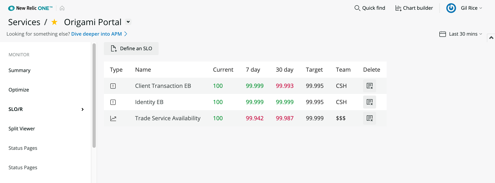

 [](https://snyk.io/test/github/newrelic/nr1-template-nerdpack)

## Usage

SLO/R is a New Relic One application intended to calculate SLO attainment for a Service. It allows you to quickly define SLOs for Error Budget, Availability, Capacity, and Latency. 

By measuring SLO attainment accross your Service estate you will be able to determine which signals are most important for a given Service, or set of Services developed and supported by a Team. Using New Relic as a consistent basis to define and measure your SLOs offers better insight into comparative SLO attainment in your service delivery organization.

We are keen to see SLO/R evolve and have many additional features and visualizations to include. For version 1.0.1 we wanted to ship the core SLO calculation capabilities. We expect to rapidly build upon this core through several releases. Please add an issue to the repo is there is a feature you would like to see.



## Open Source License

This project is distributed under the [Apache 2 license](LICENSE).

## What do you need to make this work?

Required:

- [New Relic APM agent(s) installed](https://docs.newrelic.com/docs/agents/manage-apm-agents/installation/compatibility-requirements-new-relic-agents-products). SLO/R version 1.0.1 is intended to work specifically with Services reporting to New Relic via an APM Agent. The Service provides an Entity upon which to define SLOs. Error Budget SLOs are defined directly from APM Transaction events in Insights, the other SLO types are defined with Alerts (see "Configuring SLOR Alert Webhook" section below).  

You'll get the best possible data out of this application if you also:

- A New Relic Alert webhook to forward Alert events to a SLOR_ALERTS Insights table. See "Configuring SLOR Alert Webhook" section for more details.


## Getting started

> Include a step-by-step procedure on how to get your app installed and deployed. The clone and deploy steps are similar across all apps. If your app has additional steps required to get started, include them here or in their own section.

1. First, ensure that you have [Git](https://git-scm.com/book/en/v2/Getting-Started-Installing-Git) and [NPM](https://www.npmjs.com/get-npm) installed. If you're unsure whether you have one or both of them installed, run the following command(s) (If you have them installed these commands will return a version number, if not, the commands won't be recognized):
```bash
git --version
npm -v
```
2. Next, install the [NR1 CLI](https://one.newrelic.com/launcher/developer-center.launcher) by going to [this link](https://one.newrelic.com/launcher/developer-center.launcher) and following the instructions (5 minutes or less) to install and setup your New Relic development environment.
3. Next, to clone this repository and run the code locally against your New Relic data, execute the following command:

```bash
nr1 nerdpack:clone -r https://github.com/newrelic/nr1-template-nerdpack.git
cd nr1-template-nerdpack
nr1 nerdpack:serve
```

Visit [https://one.newrelic.com/?nerdpacks=local](https://one.newrelic.com/?nerdpacks=local), navigate to the Nerdpack, and :sparkles:

## Deploying this Nerdpack

> Include the necessary steps to deploy your app. Generally, you shouldn't need to change any of these steps. 

Open a command prompt in the nerdpack's directory and run the following commands.

```bash
# If you need to create a new uuid for the account to which you're deploying this Nerdpack, use the following
# nr1 nerdpack:uuid -g [--profile=your_profile_name]
# to see a list of APIkeys / profiles available in your development environment, run nr1 credentials:list
nr1 nerdpack:publish [--profile=your_profile_name]
nr1 nerdpack:deploy [-c [DEV|BETA|STABLE]] [--profile=your_profile_name]
nr1 nerdpack:subscribe [-c [DEV|BETA|STABLE]] [--profile=your_profile_name]
```

Visit [https://one.newrelic.com](https://one.newrelic.com), navigate to the Nerdpack, and :sparkles:

# Support

New Relic has open-sourced this project. This project is provided AS-IS WITHOUT WARRANTY OR DEDICATED SUPPORT. Issues and contributions should be reported to the project here on GitHub.

We encourage you to bring your experiences and questions to the [Explorers Hub](https://discuss.newrelic.com) where our community members collaborate on solutions and new ideas.

## Community

> Work with the Explorer's Hub team to create a tag for your app, then update the link below.

New Relic hosts and moderates an online forum where customers can interact with New Relic employees as well as other customers to get help and share best practices. Like all official New Relic open source projects, there's a related Community topic in the New Relic Explorers Hub. You can find this project's topic/threads here:

https://discuss.newrelic.com/t/nr1-template-nerdpack
*(Note: URL subject to change before GA)*

## Issues / Enhancement Requests

Issues and enhancement requests can be submitted in the [Issues tab of this repository](../../issues). Please search for and review the existing open issues before submitting a new issue.

# Contributing

> Work with the Open Source Office to update the email alias below.

Contributions are welcome (and if you submit a Enhancement Request, expect to be invited to contribute it yourself :grin:). Please review our [Contributors Guide](CONTRIBUTING.md).

Keep in mind that when you submit your pull request, you'll need to sign the CLA via the click-through using CLA-Assistant. If you'd like to execute our corporate CLA, or if you have any questions, please drop us an email at opensource+nr1-template-nerdpack@newrelic.com.
