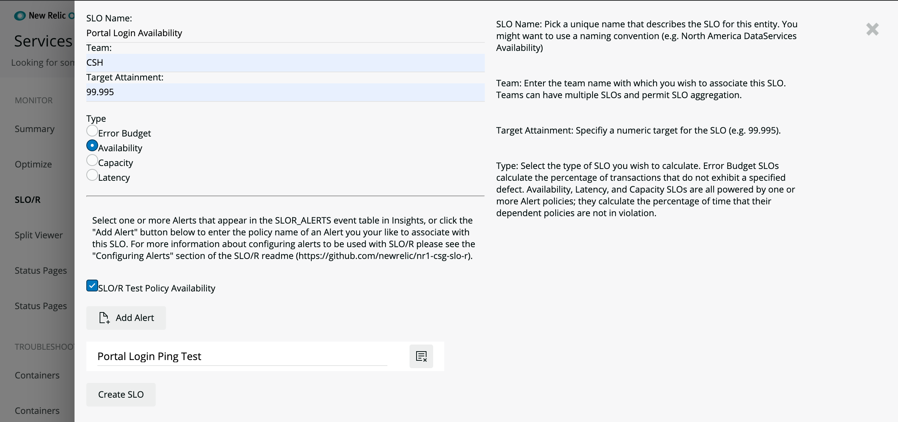
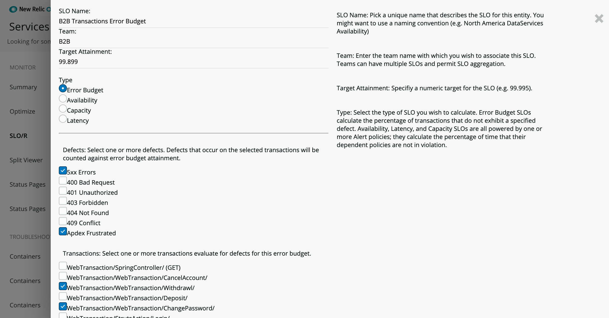
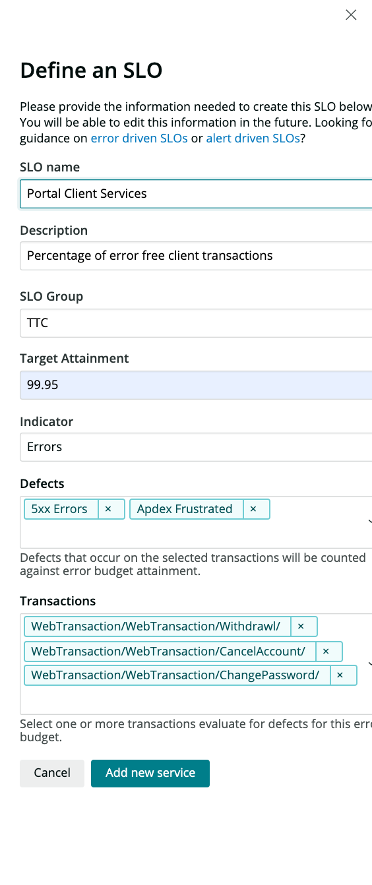
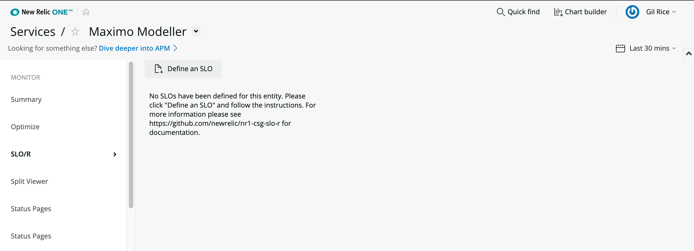
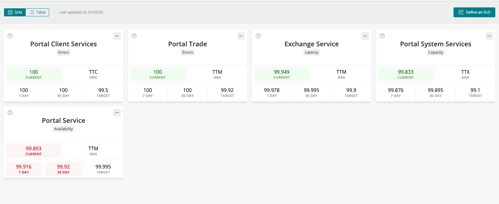

 [](https://snyk.io/test/github/newrelic/nr1-slo-r)

## Usage

SLO/R is a New Relic One Application intended to calculate SLO attainment and report on it for a service. It allows you to quickly define SLOs for Error, Availability, Capacity, and Latency conditions. You can use the applications for reporting out your results. (SLO/R - "service level obligation and reporting")

By measuring SLO attainment across your service estate you will be able to determine which signals are most important for a given service, or set of services developed and supported by a team. Using New Relic as a consistent basis to define and measure your SLOs offers better insight into comparative SLO attainment in your service delivery organization.

We are keen to see SLO/R evolve and have many additional features and visualizations to include. For version 1.0.1 we wanted to ship the core SLO calculation capabilities. We expect to rapidly build upon this core through several releases. Please add an issue to the repo is there is a feature you would like to see.

SLO/R provides two mechanisms for calculating SLOs: Error Type (calculated by defects on transactions) and Availability, Capacity, and Latency Type (calculated by total duration of Alert violation).

- For more details about the SLOs that will be calculated and their calculations please see [Error Driven SLOs](./docs/error_slos.md) and [Alert Driven SLOs](./docs/alert_slos.md).


## Open Source License

This project is distributed under the [Apache 2 license](LICENSE).

## What do you need to make this work?

Required:

- [New Relic APM agent(s) installed](https://docs.newrelic.com/docs/agents/manage-apm-agents/installation/compatibility-requirements-new-relic-agents-products).
- SLO/R is intended to work specifically with services reporting to New Relic via an APM Agent. The service provides an entity upon which to define SLOs. Error Budget SLOs are defined directly from APM Transaction events in Insights, the other SLO types are defined with Alerts (see "Configuring SLOR Alert Webhook" section below).
- A New Relic Alert webhook to forward Alert events to a SLOR_ALERTS Insights table. See "Configuring SLOR Alert Webhook" section for more details.


## Getting started

1. First, ensure that you have [Git](https://git-scm.com/book/en/v2/Getting-Started-Installing-Git) and [NPM](https://www.npmjs.com/get-npm) installed. If you're unsure whether you have one or both of them installed, run the following command(s) (If you have them installed these commands will return a version number, if not, the commands won't be recognized):
```bash
git --version
npm -v
```
2. Next, install the [NR1 CLI](https://one.newrelic.com/launcher/developer-center.launcher) by going to [this link](https://one.newrelic.com/launcher/developer-center.launcher) and following the instructions (5 minutes or less) to install and setup your New Relic development environment.
3. Next, to clone this repository and run the code locally against your New Relic data, execute the following command:

```bash
nr1 nerdpack:clone -r https://github.com/newrelic/nr1-slo-r.git
cd nr1-slo-r
nr1 nerdpack:serve
```

Visit [https://one.newrelic.com/?nerdpacks=local](https://one.newrelic.com/?nerdpacks=local), navigate to the Nerdpack, and :sparkles:

## Deploying this Nerdpack

Open a command prompt in the nerdpack's directory and run the following commands.

```bash
# If you need to create a new uuid for the account to which you're deploying this Nerdpack, use the following
# nr1 nerdpack:uuid -g [--profile=your_profile_name]
# to see a list of APIkeys / profiles available in your development environment, run nr1 credentials:list
nr1 nerdpack:publish [--profile=your_profile_name]
nr1 nerdpack:deploy [-c [DEV|BETA|STABLE]] [--profile=your_profile_name]
nr1 nerdpack:subscribe [-c [DEV|BETA|STABLE]] [--profile=your_profile_name]
```

Visit [https://one.newrelic.com](https://one.newrelic.com), navigate to the Nerdpack, and :sparkles:

## Creating a Webhook to forward Alert incidents to Insights

The Availability, Capacity, and Latency SLO types within SLO/R are calculated using the total duration of Alert violations. In order to record those Alert violations we need to enable an Insights directed Webhook to capture the _open_ and _close_ events. To enable this Webhook please follow the steps below, the Alert payload needs to be as specified for SLO/R to operate as expected. Please follow [these instructions](./docs/slor_alerts_config.md) to enable the Alert event forwarding.


For more information on sending Alerts to insights see [Sending Alerts Data to Insights](https://blog.newrelic.com/product-news/sending-alerts-data-to-insights/).


## How to configure and use SLO/R

SLO definitions are scoped and stored with Service entities. Open a Service entity by exploring your services in the Entity Explorer from the New Relic One Homepage.



Select the service you are interested in creating SLOs for. In our example we will be using the Origami Portal Service.


Select the SLO/R New Relic One App from the left hand navigation in your Entity.


If you (or others) haven't configured an SLO the canvas will be empty. Just click on the Define an SLO button to begin configuring your first SLO.


The UI will open a side panel to facilitate configuration. Fill in the fields:
- SLO Name: Give your SLO a name, this has to be unique for the service or will overwrite similarly named SLOs for this entity.
- Description: Give a quick overview of what you're basing this SLO on.
- Organization: This is grouping meta data. Typically organizations are responsible for multiple services and SLOs. This gives us an ability to roll up the SLO to an organizational attainment.
- Target Attainment: The numeric value as a percentage, you wish as your SLO target (e.g. 99.995)
- Indicator: There are 4 indicators for SLOs in SLO/R - Error, Availability, Capacity, and Latency. Error SLOs are calculated from Transaction defects. Availability, Latency, and Capacity SLOs are calculated by Alert violations.

Example Error SLO


For Error SLOs you need to define the defects you wish to measure and the transaction names you want to associate with this SLO.

Example Availability SLO


Alert driven SLOs depend on Alert events being captured by Insights in the SLOR_ALERTS table. Please see [SLO/R Alerts Config](./docs/slor_alerts_config.md) to ensure you're set up to capture Alert events.


Once you've created a few SLOs you should see a view like the following:



### How is SLO/R arriving at the SLO calculations?

Please see details [Alert SLOs](./docs/alert_slos.md) and [Error SLOs](error_slos.md).

# Support

New Relic has open-sourced this project. This project is provided AS-IS WITHOUT WARRANTY OR DEDICATED SUPPORT. Issues and contributions should be reported to the project here on GitHub.

We encourage you to bring your experiences and questions to the [Explorers Hub](https://discuss.newrelic.com) where our community members collaborate on solutions and new ideas.

## Community

New Relic hosts and moderates an online forum where customers can interact with New Relic employees as well as other customers to get help and share best practices. Like all official New Relic open source projects, there's a related Community topic in the New Relic Explorers Hub. You can find this project's topic/threads here:

https://discuss.newrelic.com/t/track-your-service-level-objectives-with-the-slo-r-nerdpack/90046

## Issues / Enhancement Requests

Issues and enhancement requests can be submitted in the [Issues tab of this repository](../../issues). Please search for and review the existing open issues before submitting a new issue.

# Contributing

Contributions are welcome (and if you submit a Enhancement Request, expect to be invited to contribute it yourself :grin:). Please review our [Contributors Guide](CONTRIBUTING.md).

Keep in mind that when you submit your pull request, you'll need to sign the CLA via the click-through using CLA-Assistant. If you'd like to execute our corporate CLA, or if you have any questions, please drop us an email at opensource+nr1-slo-r@newrelic.com.
