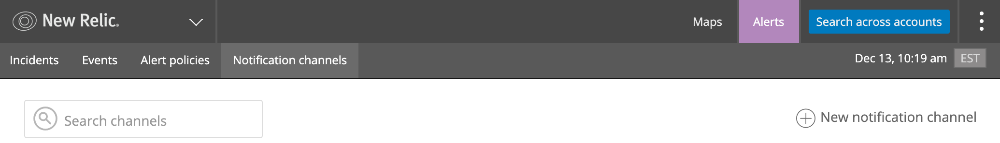
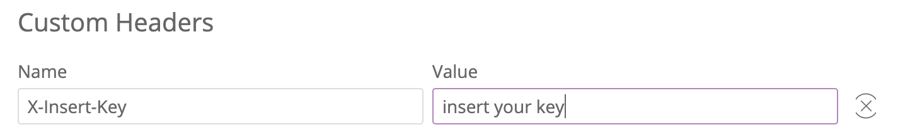
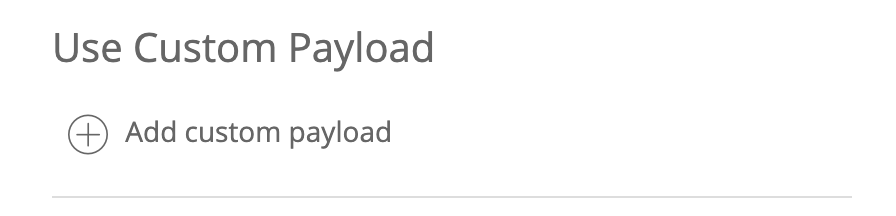

# Steps to enable the recording of Alert Events for use with SLO/R
The following must be followed if you wish to use Alert violations as the basis for Availability, Capacity, or Latency SLOs.

## 1. Generate an Insights insert token

Insights insert tokens can be generated from the _Manage data_ option in your New Relic Insights account (e.g. https://insights.newrelic.com/accounts/{your-account-id}/manage/summary 


> Appears on the left hand navigation panel on the Insights landing page.


> Select the _Add data_ option from the top navigation menu.


> We will want to create a new _Insert Key_ click the "+" sign to enter the create dialog.


> You just need to enter a note to configure the key, I recommend SLOR_ALERTS (that will be the name of the Insights event table created)


> Once your key is created keep it handy, you will need it to configure the Webhook.


## 2. Create a Webhook notification channel


> In New Relic Alerts click on "Notification Channel" and then "New notification channel"


> Select the "Webhook" channel type

> Set the "Channel name" as SLOR_ALERTS

> The "Base Url" should be the Insights collector events Url - be sure to specify your Account ID
```https://insights-collector.newrelic.com/v1/accounts/{your account id}/events```



> You will need to add a custom header and specify the X-Insert-Key you generated in step 1 above



> Add a Custom Payload

> Replace the default payload with the one below ...
```
{
  "eventType": "SLOR_ALERTS",
  "account_id": "$ACCOUNT_ID",
  "account_name": "$ACCOUNT_NAME",
  "closed_violations_count_critical": "$CLOSED_VIOLATIONS_COUNT_CRITICAL",
  "closed_violations_count_warning": "$CLOSED_VIOLATIONS_COUNT_WARNING",
  "condition_family_id": "$CONDITION_FAMILY_ID",
  "condition_name": "$CONDITION_NAME",
  "current_state": "$EVENT_STATE",
  "details": "$EVENT_DETAILS",
  "duration": "$DURATION",
  "event_type": "$EVENT_TYPE",
  "incident_acknowledge_url": "$INCIDENT_ACKNOWLEDGE_URL",
  "incident_id": "$INCIDENT_ID",
  "incident_url": "$INCIDENT_URL",
  "metadata": "$METADATA",
  "open_violations_count_critical": "$OPEN_VIOLATIONS_COUNT_CRITICAL",
  "open_violations_count_warning": "$OPEN_VIOLATIONS_COUNT_WARNING",
  "owner": "$EVENT_OWNER",
  "policy_name": "$POLICY_NAME",
  "policy_url": "$POLICY_URL",
  "runbook_url": "$RUNBOOK_URL",
  "severity": "$SEVERITY",
  "targets": "$TARGETS",
  "timestamp": "$TIMESTAMP",
  "violation_callback_url": "$VIOLATION_CALLBACK_URL",
  "violation_chart_url": "$VIOLATION_CHART_URL"
}
```


> Save your changes 


 
> You should have defined a notification channel that looks like the following

## 3. Create an Alert and add the SLOR_ALERT notification Webhook
Now you have to add the SLOR_ALERTS notification channel to any Alerts you wish to use to make SLO calculations. 

 
 > To set a notification channel just select the "Notification channel" tab in an Alert Policy and click "Add notification channels". Select the SLOR_ALERTS Webhook channel you created and associate it with the Alert. 

 > Note: An Alert has to have fired to be visible to the SLO/R configurstion. 


